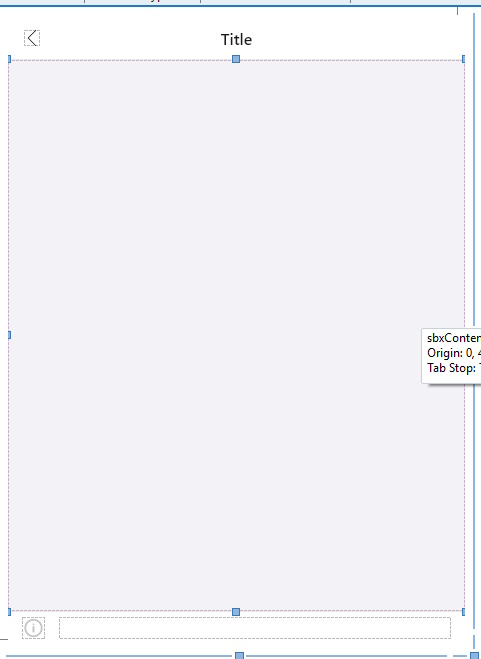
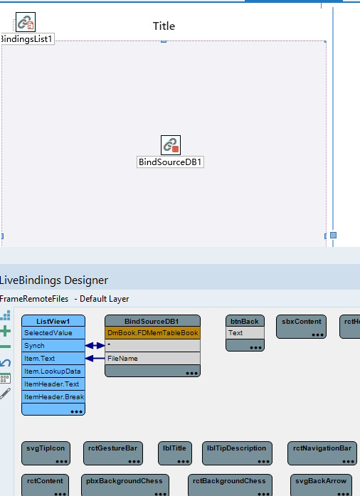

# APP 开发之使用 Frame 做界面如何简化代码
## 缘起
用 Delphi 做 APP，使用 Delphi 的 FireMonkey 框架。假设我们模拟微信的界面做一个 APP 的界面框架，大概是这个样子的：

1. APP 启动后，显示主界面。主界面底下有四个按钮；

2. 用户点击底下的四个按钮的某一个，整个屏幕显示下一层的界面。

3. 这个下一层的界面可能有多个，但每个界面顶部都是一个工具栏，工具栏的左侧是一个返回按钮，工具栏中间显示一行文字，提示用户当前 APP 在哪个功能界面。

4. 用户点击返回按钮，该界面消失，回到主界面。

一般的做法
在 Windows 年代，我一般会为每个界面，做一个 TForm 的设计。但是在做 APP 的时候，Delphi 官方的意思最好用 TFrame 而不是用 TForm。因为 TForm 占用更多的资源，对于手机这种硬件来说，节省点资源总是更好的。

因此，比如有4个主界面下一级的界面，我就需要设计4个 Frame，比如 TFrame1, TFrame2, TFrame3, TFrame4。

然后，主界面的4个按钮的 OnClick 事件里面，我们分别写代码：
~~~
  AFrame1 := TFrame1.Create(Self);
  AFrame1.Parent := Self;
  AFrame1.Align := TAlignLayout.Client;
  AFrame1.Visible := True;
  AFrame1.BringToFront;
~~~
上面的代码，分别换成 TFrame2, TFrame3, TFrame4 重复四次。

### 还有，UI 设计
另外，这四个 Frame 的 UI 的整体风格应该是一致的。比如顶上那个工具栏和返回按钮，应该是一样的外观（颜色，字体，按钮形状，等等）；

如果每个 Frame 都设计一遍，就算是 Delphi 可以在 IDE 里面拖拉控件搞定，在属性面板里面选择颜色之类的就能设计好，但重复4次也挺烦。如果有更多的相同风格的界面需要设计，就更麻烦。

**如何少写代码少干活**？

## 问题的解决
在 Delphi 这种面向对象的语言中，重复的事情，采用继承。我们把所有界面的共性抽象出来，做到一个基类里面，然后其它的真正需要用的界面，都从基类继承。

所以，我们首先设计好一个 Frame 作为基类。通过拖拉控件，我们设计好这个 Frame，命名为 TFrameBase。看图：

### 代码
我们给这个 TFrameBase 一些所有它的子类都要用到的代码：
~~~
unit UFrameBase;
{
  Frame 的基类。子类除了继承它的界面设计，也继承关闭的方法。
  关闭方法不能直接写在按钮的 OnClick 事件里面，因为这样写，代码的方法指针和事件的绑定是在资源文件里面，
  资源文件的事件绑定不会被继承的。所有，这里需要在 Create 的地方，用代码把关闭方法和按钮的 OnClick 绑定，
  代码是可以继承的。这样就不用每个 Frame 都去写关闭代码了。
}
interface
 
uses
  System.SysUtils, System.Types, System.UITypes, System.Classes, System.Variants, 
  FMX.Types, FMX.Graphics, FMX.Controls, FMX.Forms, FMX.Dialogs, FMX.StdCtrls,
  System.Skia, FMX.Skia, FMX.Layouts, FMX.Controls.Presentation, FMX.Objects;
 
type
  TFrameBase = class(TFrame)
    rctContent: TRectangle;
    rctHeader: TRectangle;
    lblTitle: TSkLabel;
    btnBack: TSpeedButton;
    svgBackArrow: TSkSvg;
    rctTip: TRectangle;
    svgTipIcon: TSkSvg;
    lytTipContent: TLayout;
    lblTipDescription: TSkLabel;
    sbxContent: TScrollBox;
    rctGestureBar: TRectangle;
    rctNavigationBar: TRectangle;
    rctStatusBar: TRectangle;
    rctBackgroundChess: TRectangle;
    pbxBackgroundChess: TSkPaintBox;
  private
    { Private declarations }
    FOnCloseMe: TNotifyEvent;
 
    procedure DoOnCloseMe;
  public
    { Public declarations }
    procedure CloseMe(Sender: TObject); virtual;
    constructor Create(AOwner: TComponent); override;
 
    property OnCloseMe: TNotifyEvent read FOnCloseMe write FOnCloseMe;
 
    class procedure ShowMyFrame<T: TFrameBase>(AParent: TFmxObject; ACloseEvent: TNotifyEvent);
  end;
 
implementation
 
uses System.Threading;
 
{$R *.fmx}
 
procedure TFrameBase.CloseMe(Sender: TObject);
begin
  Self.DoOnCloseMe;
  Self.Hide;
 
  TTask.Run(
  procedure
  begin
    Sleep(20);
    TThread.queue(nil,
    procedure
    begin
      Self.Free;
    end)
  end
  );
end;
 
constructor TFrameBase.Create(AOwner: TComponent);
begin
  inherited;
  btnBack.OnClick := CloseMe;
end;
 
procedure TFrameBase.DoOnCloseMe;
begin
  if Assigned(Self.FOnCloseMe) then Self.FOnCloseMe(Self);
end;
 
class procedure TFrameBase.ShowMyFrame<T>(AParent: TFmxObject; ACloseEvent: TNotifyEvent);
var
  AFrame: TFrameBase;
begin
  AFrame := T.Create(AParent);
  AFrame.Parent := AParent;
  AFrame.Align := TAlignLayout.Contents;
  AFrame.BringToFront;
  AFrame.FOnCloseMe := ACloseEvent;
end;
 
end.
~~~

#### 上述代码的解释：

1. FOnCloseMe 是一个事件，当这个 Frame 被关闭的时候，通过这个事件通知需要知道的地方。

2. 类方法 TFrameBase.ShowMyFrame 采用了泛型，因此在创建它的子类的时候调用这个方法，只要输入子类的类型，比如 TFrame2 则它创建的就是 TFrame2 而不是 TFrameBase；这里把创建以及创建后要做的相同代码都集中到这里，也就不需要在每个需要呈现界面的地方都重复写这样的创建代码了。

3. 退出界面的方法 CloseMe，这里需要解释一下。这个方法绑定到界面上的返回按钮的 OnClick 事件，当我们点击返回按钮，这个方法被调用。原本我在这里写的是：Self.Free；测试的时候发现，TFrame1 这个界面确实被关闭了，主界面显示出来了。但是此时如果是 WINDOWS，如果鼠标去点击主界面右上角的 X 按钮关闭程序，则点击没反应。改为点击后启动一个线程，然后让线程去执行 Self.Free 则没有这个问题。因此 CloseMe 这个函数稍微复杂一点。

4. 既然是点击返回按钮关闭当前 Frame，为什么不直接在设计期，双击 Button.OnClick 事件，然后在事件框架里面写 CloseMe，还要在 TFrameBase.Create 这个方法里面去执行事件绑定操作？如果仅仅是在 Button.OnClick 里面做设计期的绑定，继承的 Frame 是没有这个事件的。必须用代码绑定，而且这个代码要写在子类可以继承的函数或者方法里面。

实际要用的子类
假设我有一个实际要使用的子类是一个文件名列表的显示界面。在 Delphi IDE 的菜单里，选择 File->New->Other 就会弹出一个窗口。在这个窗口的左侧栏，选择 inheritedItems，右侧就会出现当前工程项目里面的所有 Form 和 Frame，在里面找到 TFrameBase，窗口底部的 inherit 的 Raido Button 处于被选择状态，点击窗口底部的 OK 按钮，IDE 就产生了一个从 TFrameBase 继承下来的 Frame，它的界面外观和 TFrameBase 一样，顶部有返回按钮。此时我们就可以在这个新的 Frame 里面开始功能设计了。

为了说清楚整个流程，这里简单说一下这个用于显示文件名列表的 Frame 的功能设计：

1. 文件名列表是在一个数据库的表里面，表有一个字段，字段名为 FileName；这个表我采用了 FdMemTable 这个控件（方便测试和演示）。

2. 拖一个 ListView 到这个 Frame 上面，设置它的 Align 为 Client 让它占满整个 Frame 中间的空白部分。

4. 鼠标右键点 Frame ，在弹出来的菜单里面选择 Bind Visually 开始可视化数据绑定。IDE 的底部出来 LiveBindings Designer 界面，在里面使用鼠标把数据表和 ListView 之间拉上线就建立好了数据绑定关系。如下图：

### 主界面的按钮如何显示上述 Frame
代码如下：
~~~
procedure TFmMain.SpeedButton1Click(Sender: TObject);
begin
  DmBook.OpenMyBookDB;
 
  TFrameBase.ShowMyFrame<TFrameRemoteFiles>(Self, DoFileListClose);
end;
~~~
#### 上述代码的解释：

1. 首先打开数据库的表。这样才能在前面我们设计的 ListView 里面显示文件名列表；

2. 调用 TFrameBase 的类方法，传入真正要创建的类名：TFrameRemoteFiles；

3. DoFileListClose 是 TFmMain 的一个方法，当这个 Frame 被关闭释放的时候被调用。

# 总结
当一个 APP 有很多基本界面框架相同，显示的内容不同的时候，我们可以从 FrameBase 继承下来，就少写了很多代码，也节约了很多界面设计操作的时间。

最好呈现的效果是，点击某个按钮，屏幕上就显示对应的界面。点击该界面的返回按钮，因为该界面被释放了，因此就自然地显示了该界面弹出来之前的界面。如果是多级界面，逐级进入，这个框架底下，返回界面也就逐级返回，有了界面逐层堆叠，逐级返回的效果。