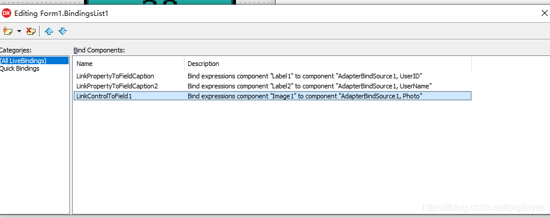
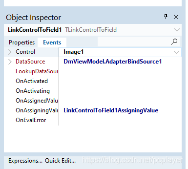

# LiveBindings 绑定对象里面的图片字段，对象要平台中立

## 问题来源：
假设我有一个数据对象 TnUser = class

里面需要存储图片。

因为 Delphi 的 VCL 和 FMX 对图片的处理，引用的单元不同，为了让这个 TnUser 更单纯，平台中立，它只能存储图片的二进制数据，而不是 TBitmap 或者 TJpeg 这样的对象。

因此，我在这里直接用一个 TMemroyStream 来存储图片的数据。

 

问题来了，我在 ViewModel 里面通过拖放 AdapterBindSource1 和 DataGeneratorAdapter1 并且在 DataGeneratorAdapter1 里面定义对应 TnUser 的字段，图片字段只有 Bitmap 类型。这里面没有 Blob 类型也没有 Stream 类型的字段。

 

在 View 模块也就是界面 Form 上面拖放一个 TImage，一个 BindingsList1，可视化创建 LiveBinding 绑定。设计期可以看到图片。

程序运行时创建 TnUser 的实例，但不给 Photo (TMemoryStream) 赋值。界面上另外两个 string 类型的字段显示出来了，没有图。到这里一切顺利。

 

点击界面按钮，加载一个 JPEG 图片到 FUser 的 Photo 字段，也就是把 Jpeg 文件的数据写入 MemoryStream，刷新绑定，则出来一个类型转换错误。Image 不能对应 Stream。

## 解决办法
如何解决这个问题。当然我首先想到运行期做类型转换。在界面上，双击 BindingsList1，弹出窗口，里面就是可视化创建的连接的对象。选中绑定图片的那个对象，在属性面板里面，切换到事件，可以看到几个事件，其中两个是：OnAssignedValue 和 OnAssigningValue，显然应该在 OnAssigningValue 事件里面写代码转换数据。但因为我还不熟悉 TValue 的操作，一时搞不定转换的数据如何写进去，于是开始想别的办法。

### 以下是别的办法的测试结果：
为了让数据对象 TnUser 平台独立，也就是不要包含 VCL 或者 FMX 的代码，

其中的 Photo 采用 TStream 直接存储数据。

 

如果把这个 Photo 属性直接 LiveBinding 到界面上的 Image，则运行时会说类型转换错误。

那么，这里如何插入我自己写的类型转换代码？

在 LiveBinding 的框架里面，暂时找不到地方插入代码。也搜索不到相关文档。

--- 搞定。2020-2-13 凌晨 3 点。类型转换只需要在连接的事件 OnAssigningValue 里面写，去更改其 TValue 就可以了。

 

因此，我测试了以下方法：

 

1. 给 TnUser 增加一个 Helper 类，为这个类增加一个 Photo2 属性，这个属性是 TBitmap；（本模块是 ViewModel，可以平台相关）  

2. 绑定 Image 到 Photo2。但是，运行时，不会触发到 Helper 类的方法。  

2.1. 增加一个测试按钮，测试 FUser.Photo2，可以触发 Helper 类的方法，可以获得 Photo2 的属性并显示出来，说明 Helper 类没写错。也就说明 LiveBinding 在执行绑定的时候不认识 Helper 类。  

3. 本模块自己重新引入相关属性，然后绑定到本模块而不是 FUser，运行时出异常；原因是 AdapterBindSource1.OnCreateAdapter 先于本模块的创建。  

3.1. 就算把 AdapterBindSource1.AutoActive 设置为 True，它的事件方法依然先于本模块的 Create 被触发调用。  

因此，不能采用设置 AutoActive 为 False 然后在运行期设置为 True 来解决这个问题。  

4. 继承 TnUser，在继承的类里面实现 Photo4 属性，这个属性是 TBitmap 或者 TJpeg，绑定此对象，都能显示。  

4.1. 为了跨平台而继承，不是好的解决方法。  

做完上面那些测试后，回到数据转换，仔细查看 TValue，发现可以写入数据。

### 正确的解决方法
双击界面上的 BindingsList1 弹出窗口：

选中上面关于图片的连接，看看它的属性面板里面的事件：

双击 OnAssigningValue 事件，在 IDE 创建的代码框架里面写如下代码：
~~~
procedure TForm1.LinkControlToField1AssigningValue(Sender: TObject;
  AssignValueRec: TBindingAssignValueRec; var Value: TValue;
  var Handled: Boolean);
var
  Jpg: TJpegImage;
begin
  if Value.IsObject then
  begin
    if Value.AsObject is TStream then
    begin
      TStream(Value.AsObject).Position := 0;
      Jpg := TJpegImage.Create;
      try
        Jpg.LoadFromStream(TStream(Value.AsObject));
 
        Value := TValue.From(Jpg);
      finally
        //Jpg.DisposeOf;    这里不能释放 Jpg 对象，否则会 AV。因此，程序在这里需要用一个 TForm1 里面定义的 Jpg 对象反复使用而不是每次都在这里创建新的。
      end;
    end;
 
  end;
 
end;
~~~

上述代码搞定，完成了绑定的对象的属性是 TStream 转换为目标需要的 TJpegImage 或者 TBitmap 的问题。这里主要的问题是对 TValue 的操作。

在 VCL 框架下，这里是 TJpegImage 或者是 TBitmap 都能够让界面上绑定的 TImage 正确显示图片。

这样，就实现了数据对象的代码平台中立。而界面 View 肯定是和平台相关的。连 ViewModel 都无需关注平台相关代码。
