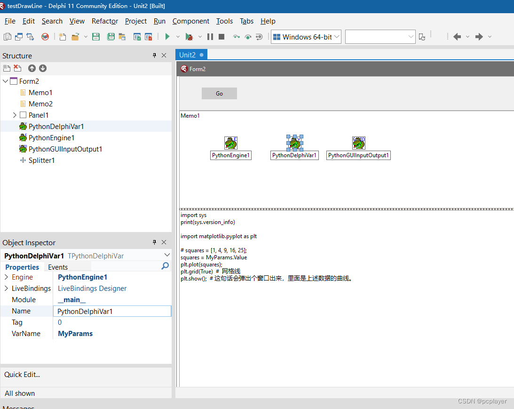

# 用 Delphi 程序调用 Python 代码画曲线图 -- 数据来自 Delphi 程序
接本博客上一篇文章，使用 Python 的 matplotlib 库画曲线。

上次是为了实现调用该库，数据是直接写死在 Python 代码里面的。代码是这一行：
~~~
 squares = [1, 4, 9, 16, 25];
~~~
既然是 Delphi 调用 Python 的库，数据应该是 Delphi 的程序传递给 Python 的代码，然后 Python 的代码利用 Python 库把图画出来。

比如，数据可能来自数据库。做数据库编程，Delphi 非常擅长啊。

上述 Python 代码，是把很多数字，给了一个数组类型的变量。

在 Delphi 这边，首先，拖一个控件到界面上：PythonDelphiVar1

设置 PythonDelphiVar1.VarName := 'MyParams';  这个 MyParams 就是在 Python 代码中，Python 可以读 Delphi 传递过来的数据的变量名。

然后给 PythonDelphiVar1.OnGetData 事件写程序。Python 的数组，在 Delphi 这边该如何传递数据过去呢？我猜了一下，写下代码测试。结果猜中。代码如下：
~~~
procedure TForm2.PythonDelphiVar1GetData(Sender: TObject; var Data: Variant);
begin
{------------------------------------------------------------------------
   # squares = [1, 4, 9, 16, 25];
   squares = MyParams.Value
   在 Python 里面使用第二行代码，就可以在 Delphi 里面，通过下面的 VarArrayOf 赋值给 Python 了。
   测试通过。
------------------------------------------------------------------------}
 
  Data := VarArrayOf([1, 4, 9, 16, 30]);
end;
~~~
在 **Python** 那边，原来的数组变量赋值的语句就不需要了。改为向  Params 这个变量要数据。代码如下：
~~~
import sys
print(sys.version_info)
 
import matplotlib.pyplot as plt
 
# squares = [1, 4, 9, 16, 25];
squares = MyParams.Value
plt.plot(squares);
plt.grid(True)  #  网格线
plt.show();  # 这句话会弹出个窗口出来，里面是上述数据的曲线。
~~~
看过本系列前面两篇文章的朋友应该知道，上述 Python 代码里面的 squares = MyParams.Value 会触发 Delphi 这边绑定的 PythonDelphiVar1.OnGetData 事件。在 Delphi 程序的上述事件里面，我们给出数据，把数据变成 Variant 数组。Python 代码就获得数据了。

### 以下是设计期界面

### 以下是运行期界面

# 结论：
用 Delphi 做数据库操作，然后需要根据数据画出图表来的时候，虽然 Delphi 有 TChat 之类的画图表的控件可以用，但也可以使用 Python 的库，可以获得更多的画图表的功能。

至于使用 Python 的库，能画出多复杂的图表，或者能画多漂亮，网上关于这方面的教程很多，可能开源现成的代码也很多。
