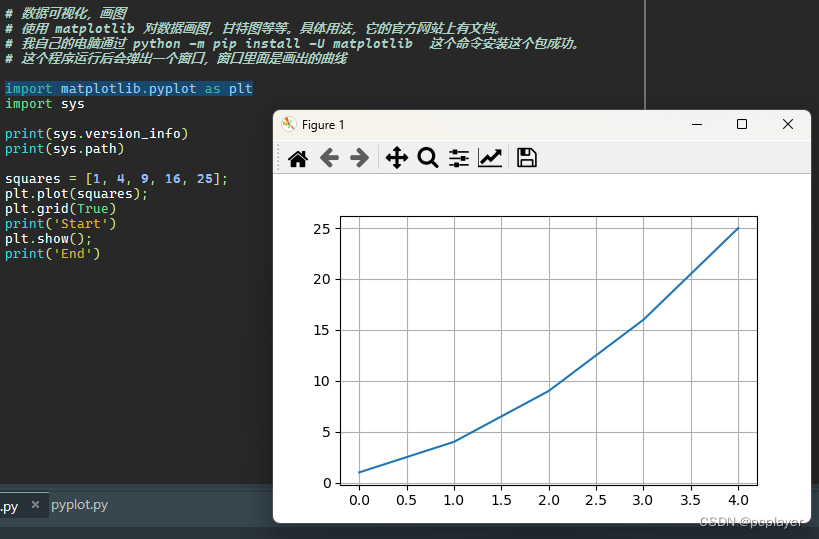
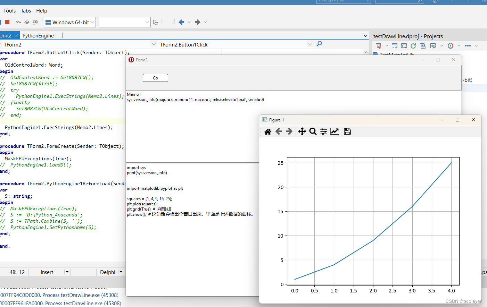

# 用 Delphi 程序调用 Python 代码画曲线图

## 概述
Python 有给数据画图的库。在 Delphi 里面我们可能使用画图控件 TChart 之类的。如果我的 Delphi 程序，想要画某种曲线图，现成的控件没有提供类似功能，而 Python 的库里面刚好有，可以考虑使用 Python 来画图。

### 使用 Python 画图
Python 代码如下：
~~~
import matplotlib.pyplot as plt
 
squares = [1, 4, 9, 16, 25];
plt.plot(squares);
plt.grid(True)  #  网格线
plt.show();  # 这句话会弹出个窗口出来，里面是上述数据的曲线。
~~~
把以上代码，放进 PyScripter 这个 Python 的开发工具 IDE 里面，点三角形小箭头图标（Run  按钮），或者按 F9 （Run 快捷键），代码运行起来，弹出一个窗口，里面是曲线。

运行结果如图：

### 在 Delphi 的程序里面调用上述 Python 代码画图
1. 创建一个 VCL 程序。

2. 按照前两篇文章，放一个 TPanel，一个按钮在 TPanel 上面。再放两个 TMemo。

3. 拖 PythonEngine1 和 PythonGUIInputOutput1 到界面上。这里的 PythonGUIInputOutput1 注意用于 Python 代码的 print() 函数的输出显示。如何设置，请看本博客前面一篇文章。

4. 在 Memo2 里面，填入上述的 Python 代码；

5. 双击 Button1，Delphi IDE 自动创建 Button1 的 OnClick 事件代码框架，在里面写代码：
~~~
procedure TForm1.Button1Click(Sender: TObject);
begin
  PythonEngine1.ExecStrings(Memo2.Lines);
end;
~~~
6. 点击 Delphi IDE 上面的三角形按钮（Run），程序运行。在运行的程序上面点那个按钮，Python 代码被执行，Python 的画图库 matplotlib 弹出窗口。运行结果如图：

## 问题
看上面描述的步骤，很简单，就可以使用 Delphi 程序调用 Python 的库。前后只要几分钟就搞定。

实际上，我搞了几个小时。因为，按照上面的步骤搞完，我点击 Button1，运行 Python 程序，出现异常错误。错误提示如下：

Project testDrawLine.exe raised exception class $C000008E with message 'c000008e FLOAT_DIVIDE_BY_ZERO'.

为了查这个问题，花了很多时间，各种测试。因为同样的代码在 PyScripter 里面能够正常运行，所以我首先怀疑 PyScripter 运行的 Python 环境和我的 Delphi 的程序运行的 Python 环境不一致。当然，解决这个问题就是采用 Python 的 sys.version_info 去看 Python 版本。这就是前面的 Python 代码里面有 print(sys.version_info) 这一行的原因。

然后上网搜了一大堆的文章。网上各种文章里面的解决办法都试过了。最后找到这篇：
https://github.com/pyscripter/python4delphi/wiki/FindingPython

然后根据这篇文章，又找到这篇：
https://github.com/pyscripter/python4delphi/wiki/MaskFPUExceptions
根据这篇文章，其实只需要增加一行代码，问题就解决：
~~~
procedure TForm1.FormCreate(Sender: TObject);
begin
  MaskFPUExceptions(True);
end;
~~~
上面的 MaskFPUExceptions 函数，在 PythonEngine.pas 单元里面。

接下来，我要研究如何用 Delphi 程序，把画曲线的数据送进 Python 里面去。